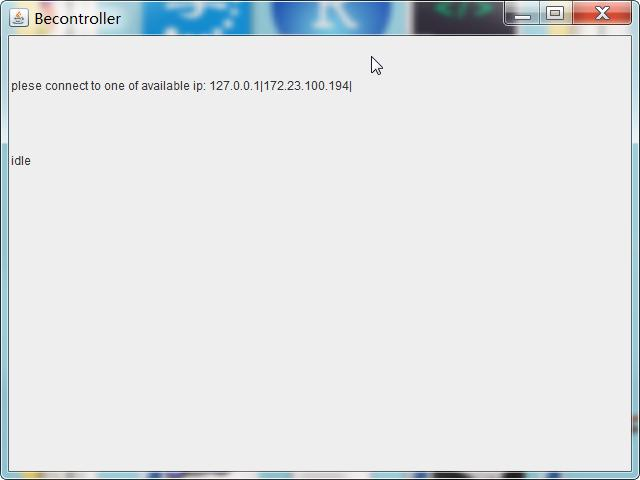
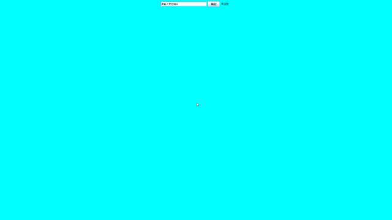

# Quick start

you can type the following cmd in your PC that is seen as a becontroller.
```
java -jar MKtool.jar server
```
and then you will see like this:


this time, the server receiving instructions have been started.
----
you can type the following cmd in your PC that is seen as a controller.
```
java -jar MKtool.jar client
```
and then you will happily found the client opened!

just like:



WOW! amazing!

Type ip of the becontroller into the text box, and click the button.
By the way, the ip must be in the same local area network of the controller.

enjoy yourself!
